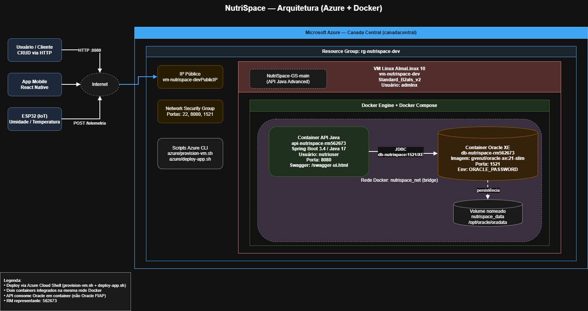
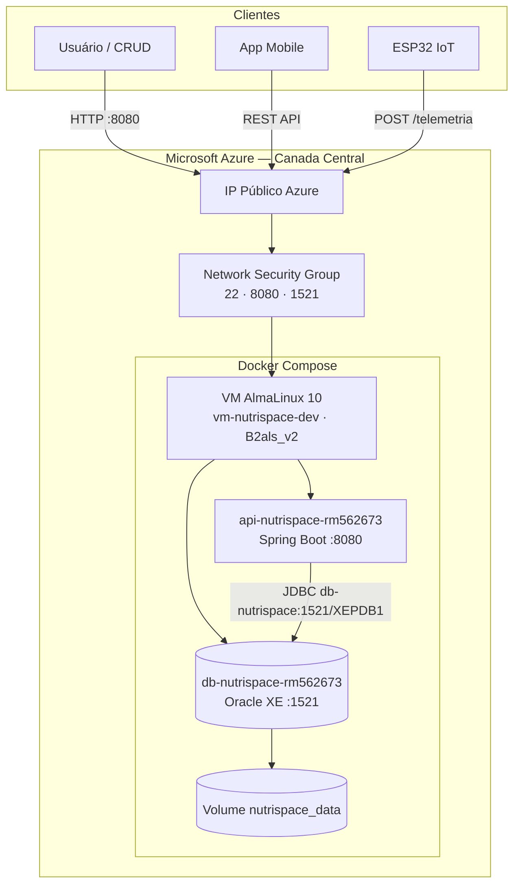

# NutriSpace — DevOps Tools & Cloud Computing

Global Solution 2026/1 · Conteinerização da API Java Advanced com Docker e deploy em Azure.

**Repositório:** https://github.com/GuuiSOares/nutrispace-devops

---

## Equipe

| Nome | RM |
|------|-----|
| Lucas Silva Gastão Pinheiro | 563960 |
| Geovanne Coneglian Passos | 562673 |
| Guilherme Soares de Almeida | 563143 |

Representante da equipe: **RM 562673**

---

## Descrição da solução

O NutriSpace é um sistema de gerenciamento de estufas automatizadas para cultivo em ambientes extremos. A solução integra dispositivos IoT (ESP32), API REST em Spring Boot, banco Oracle e aplicativo mobile.

Na disciplina DevOps, a API Java e o Oracle XE são executados em containers Docker em uma VM Linux no Microsoft Azure.

---

## Arquitetura macro



Arquivo editável (Draw.io): [`docs/arquitetura-azure.drawio`](docs/arquitetura-azure.drawio)



| Componente | Descrição |
|------------|-----------|
| Azure VM | AlmaLinux 10, `Standard_B2als_v2`, região Canada Central |
| Resource Group | `rg-nutrispace-dev` |
| Container API | `api-nutrispace-rm562673` — Spring Boot, porta 8080 |
| Container Banco | `db-nutrispace-rm562673` — Oracle XE, porta 1521 |
| Rede Docker | `nutrispace_net` |
| Volume | `nutrispace_data` (volume nomeado Docker) |

Fluxo: usuário, mobile ou IoT → IP público da VM → API → Oracle (persistência).

---

## Estrutura do repositório

```
nutrispace-devops/
├── Dockerfile
├── docker-compose.yml
├── .env.example
├── azure/
│   ├── provision-vm.sh
│   ├── deploy-app.sh
│   └── cleanup-vm.sh
├── docs/
│   ├── arquitetura-azure.drawio
│   └── arquitetura-azure.png
└── NutriSpace-GS-main/
    └── (API Java Advanced)
```

---

## Containers

| Container | Imagem | Porta |
|-----------|--------|-------|
| `api-nutrispace-rm562673` | Build via `Dockerfile` | 8080 |
| `db-nutrispace-rm562673` | `gvenzl/oracle-xe:21-slim` | 1521 |

---

## Pré-requisitos

- Conta Azure for Students
- Azure CLI (`az login`)
- Git

---

## Execução em nuvem

### 1. Clonar o repositório

```bash
git clone https://github.com/GuuiSOares/nutrispace-devops.git
cd nutrispace-devops
```

### 2. Provisionar infraestrutura na Azure

```bash
bash azure/provision-vm.sh
```

| Parâmetro | Valor |
|-----------|-------|
| Resource Group | `rg-nutrispace-dev` |
| VM | `vm-nutrispace-dev` |
| Região | `canadacentral` |
| SO | AlmaLinux 10 |
| Tamanho | `Standard_B2als_v2` |

O script cria a VM, libera as portas **22**, **8080** e **1521**, instala o Docker e grava o IP em `azure/vm-info.env`.

### 3. Publicar a aplicação na VM

```bash
bash azure/deploy-app.sh
```

Aguarde alguns minutos na primeira execução (build da API + inicialização do Oracle).

Swagger: `http://<IP-VM>:8080/swagger-ui.html` (IP em `azure/vm-info.env`)

Confirmar que a API usa o Oracle **em container** (nao o Oracle FIAP):

```bash
docker compose ps
docker volume ls | grep nutrispace_data
docker compose logs api-nutrispace | tail -20
```

O servico `db-nutrispace` deve estar `healthy` e a URL de conexao no compose aponta para `db-nutrispace:1521`.

### 4. Verificar execução

Via SSH na VM (opcional, para evidências):

```bash
ssh admlnx@<IP_PUBLICO>
docker compose ps
docker compose logs db-nutrispace
docker compose logs api-nutrispace
```

### 5. Inspecionar containers

```bash
docker container exec -it api-nutrispace-rm562673 sh
pwd
ls -l
whoami
exit

docker container exec -it db-nutrispace-rm562673 bash
pwd
ls -l
whoami
exit
```

### 6. Consultar o banco

```bash
docker container exec db-nutrispace-rm562673 bash -c \
  "echo \"SELECT table_name FROM user_tables WHERE table_name LIKE 'TB_NS%';\" | sqlplus -s system/Fiap@2tdsvms@localhost:1521/XEPDB1"
```

### 7. Testar a API

Swagger: `http://<IP_PUBLICO>:8080/swagger-ui.html`

Login:

```bash
curl -X POST http://<IP_PUBLICO>:8080/auth/login \
  -H "Content-Type: application/json" \
  -d '{"email":"<email>","senha":"<senha>"}'
```

CRUD de plantas (com token JWT):

```bash
# CREATE
curl -X POST http://<IP_PUBLICO>:8080/plantas \
  -H "Content-Type: application/json" \
  -H "Authorization: Bearer <TOKEN>" \
  -d '{"nomePlanta":"Tomate Lunar","tempMinIdeal":20,"tempMaxIdeal":30,"umiMinIdeal":50}'

# READ
curl http://<IP_PUBLICO>:8080/plantas -H "Authorization: Bearer <TOKEN>"

# UPDATE
curl -X PUT http://<IP_PUBLICO>:8080/plantas/<id> \
  -H "Content-Type: application/json" \
  -H "Authorization: Bearer <TOKEN>" \
  -d '{"nomePlanta":"Tomate Lunar V2","tempMinIdeal":20,"tempMaxIdeal":32,"umiMinIdeal":55}'

# DELETE
curl -X DELETE http://<IP_PUBLICO>:8080/plantas/<id> -H "Authorization: Bearer <TOKEN>"
```

Após cada operação de escrita, validar no banco:

```bash
docker container exec db-nutrispace-rm562673 bash -c \
  "echo \"SELECT id_planta, nome_planta FROM tb_ns_planta;\" | sqlplus -s system/Fiap@2tdsvms@localhost:1521/XEPDB1"
```

---

## Comandos auxiliares

```bash
docker volume ls
docker network ls
docker compose down
bash azure/cleanup-vm.sh
```

---

## Scripts Azure CLI

| Script | Descrição |
|--------|-----------|
| [`azure/provision-vm.sh`](azure/provision-vm.sh) | Resource Group, VM AlmaLinux, portas e Docker |
| [`azure/deploy-app.sh`](azure/deploy-app.sh) | Clone do GitHub e `docker compose up -d --build` |
| [`azure/cleanup-vm.sh`](azure/cleanup-vm.sh) | Exclusão do Resource Group |

---

## API Java

Documentação da aplicação: [NutriSpace-GS-main/README.md](NutriSpace-GS-main/README.md)
