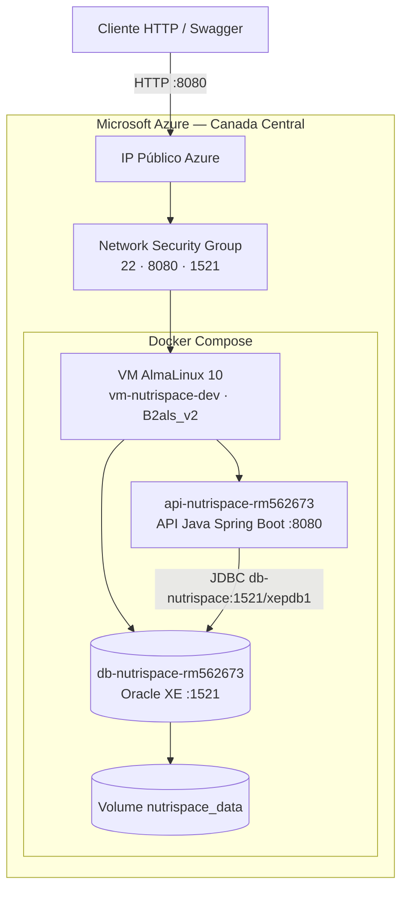

# NutriSpace — DevOps

API Java NutriSpace containerizada com Docker e Oracle XE, executada em VM Linux no Microsoft Azure.

**Repositório:** https://github.com/GuuiSOares/nutrispace-devops

---

## Equipe

| Nome | RM |
|------|-----|
| Lucas Silva Gastão Pinheiro | 563960 |
| Geovanne Coneglian Passos | 562673 |
| Guilherme Soares de Almeida | 563143 |

Representante: **RM 562673**

---

## Descrição da solução

Este repositório conteineriza a API REST Java (Spring Boot) do NutriSpace com Docker e Oracle XE, executando ambos em uma VM Linux no Microsoft Azure.

O acesso externo é feito pelo IP público da VM na porta 8080. A API persiste os dados no Oracle via rede interna Docker (`nutrispace_net`).

---

## Arquitetura macro



| Componente | Descrição |
|------------|-----------|
| Azure VM | AlmaLinux 10, `Standard_B2als_v2`, região Canada Central |
| Resource Group | `rg-nutrispace-dev` |
| Container API | `api-nutrispace-rm562673` — API Java Spring Boot, porta 8080, usuário `nutriuser` |
| Container Banco | `db-nutrispace-rm562673` — Oracle XE, porta 1521, schema `nutrispace` |
| Rede Docker | `nutrispace_net` |
| Volume | `nutrispace_data` |

---

## Estrutura do repositório

```
nutrispace-devops/
├── Dockerfile
├── docker-compose.yml
├── docker/
│   ├── application-docker.properties
│   ├── schema-docker.sql
│   └── data-docker.sql
├── azure/
│   ├── provision-vm.sh
│   ├── deploy-app.sh
│   └── cleanup-vm.sh
├── docs/
│   └── arquitetura-azure.drawio
└── NutriSpace-GS-main/
    └── API Java (Spring Boot)
```

---

## Containers

| Container | Imagem | Porta |
|-----------|--------|-------|
| `api-nutrispace-rm562673` | Build via `Dockerfile` | 8080 |
| `db-nutrispace-rm562673` | `gvenzl/oracle-xe:21-slim-faststart` | 1521 |

---

## Pré-requisitos

- Conta Azure
- [Azure CLI](https://learn.microsoft.com/cli/azure/install-azure-cli) autenticado (`az login`)
- Git

---

## Credenciais padrão

| Acesso | Usuário | Senha |
|--------|---------|-------|
| SSH na VM | `admlnx` | `Fiap@2tdsvms` |
| API (Swagger) | `lucas@nutrispace.com` | `senha123` |

Valores definidos em `azure/provision-vm.sh` (VM) e `docker/data-docker.sql` (API).

---

## How to — execução completa

### Passo 1 — Clonar o repositório

Na máquina local:

```bash
git clone https://github.com/GuuiSOares/nutrispace-devops.git
cd nutrispace-devops
```

### Passo 2 — Provisionar a VM na Azure

Na máquina local:

```bash
bash azure/provision-vm.sh
```

| Parâmetro | Valor |
|-----------|-------|
| Resource Group | `rg-nutrispace-dev` |
| VM | `vm-nutrispace-dev` |
| Região | `canadacentral` |
| SO | AlmaLinux 10 |
| Tamanho | `Standard_B2als_v2` |

O script cria a VM, libera as portas 22, 8080 e 1521, instala o Docker e grava o IP em `azure/vm-info.env`.

### Passo 3 — Publicar a aplicação

Na máquina local:

```bash
bash azure/deploy-app.sh
```

Aguarde 5 a 8 minutos na primeira execução (build da API e inicialização do Oracle).

Consultar o IP público:

```bash
source azure/vm-info.env && echo $VM_PUBLIC_IP
```

### Passo 4 — Verificar os containers

Conectar na VM (usuário e senha na seção [Credenciais padrão](#credenciais-padrão)):

```bash
ssh admlnx@<IP_PUBLICO>
cd ~/nutrispace-devops
docker compose ps
docker compose logs db-nutrispace --tail 30
docker compose logs api-nutrispace --tail 30
docker volume ls | grep nutrispace_data
```

Verificações:

- Serviço `db-nutrispace` com status `healthy`
- Log da API contendo `Started NutrispaceApplication`
- Volume `nutrispace_data` listado

### Passo 5 — Inspecionar os containers

Container da API:

```bash
docker container exec -it api-nutrispace-rm562673 sh
pwd
ls -l
whoami
exit
```

Resultado esperado: diretório `/app`, usuário `nutriuser`.

Container do banco:

```bash
docker container exec -it db-nutrispace-rm562673 bash
pwd
ls -l
whoami
exit
```

### Passo 6 — Consultar tabelas no banco

```bash
docker exec db-nutrispace-rm562673 bash -c 'sqlplus -s / as sysdba <<EOF
ALTER SESSION SET CONTAINER = XEPDB1;
SELECT table_name FROM dba_tables WHERE owner='"'"'NUTRISPACE'"'"' AND table_name LIKE '"'"'TB_NS%'"'"' ORDER BY table_name;
EXIT;
EOF'
```

### Passo 7 — Autenticar na API

Swagger: `http://<IP_PUBLICO>:8080/swagger-ui/index.html`

Credenciais na seção [Credenciais padrão](#credenciais-padrão).

Via curl:

```bash
curl -X POST http://<IP_PUBLICO>:8080/auth/login \
  -H "Content-Type: application/json" \
  -d '{"email":"lucas@nutrispace.com","senha":"senha123"}'
```

No Swagger:

1. Executar **POST** `/auth/login` com as credenciais acima
2. Copiar o valor de `token` da resposta
3. Clicar em **Authorize** e informar `Bearer <token>`

### Passo 8 — CRUD de plantas

Substituir `<IP_PUBLICO>`, `<TOKEN>` e `<id>` pelos valores reais.

```bash
# CREATE
curl -X POST http://<IP_PUBLICO>:8080/plantas \
  -H "Content-Type: application/json" \
  -H "Authorization: Bearer <TOKEN>" \
  -d '{"nomePlanta":"Tomate Lunar","tempMinIdeal":20,"tempMaxIdeal":30,"umiMinIdeal":50}'

# READ
curl http://<IP_PUBLICO>:8080/plantas -H "Authorization: Bearer <TOKEN>"

# UPDATE
curl -X PUT http://<IP_PUBLICO>:8080/plantas/<id> \
  -H "Content-Type: application/json" \
  -H "Authorization: Bearer <TOKEN>" \
  -d '{"nomePlanta":"Tomate Lunar V2","tempMinIdeal":20,"tempMaxIdeal":32,"umiMinIdeal":55}'

# DELETE
curl -X DELETE http://<IP_PUBLICO>:8080/plantas/<id> -H "Authorization: Bearer <TOKEN>"
```

Equivalente no Swagger: endpoints em `/plantas`.

### Passo 9 — Consultar plantas no banco após escrita

Após cada operação de CREATE, UPDATE ou DELETE:

```bash
docker exec -it db-nutrispace-rm562673 bash
sqlplus / as sysdba
```

```sql
ALTER SESSION SET CONTAINER = XEPDB1;
SELECT id_planta, nome_planta FROM nutrispace.tb_ns_planta;
EXIT;
```

---

## Comandos auxiliares

```bash
docker network ls
docker compose down
docker compose down -v
bash azure/cleanup-vm.sh
```

| Script | Função |
|--------|--------|
| `azure/provision-vm.sh` | Cria VM, portas e Docker |
| `azure/deploy-app.sh` | Clona o repositório na VM e executa `docker compose up -d --build` |
| `azure/cleanup-vm.sh` | Remove o Resource Group |

---
